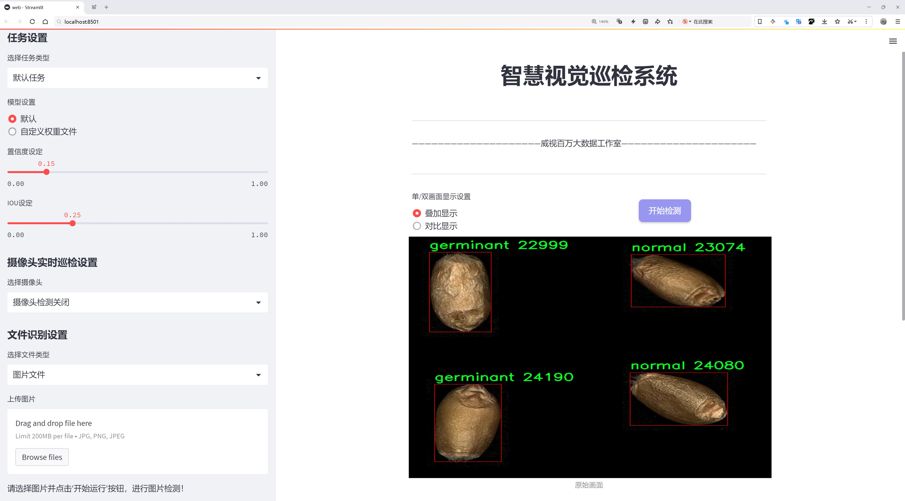
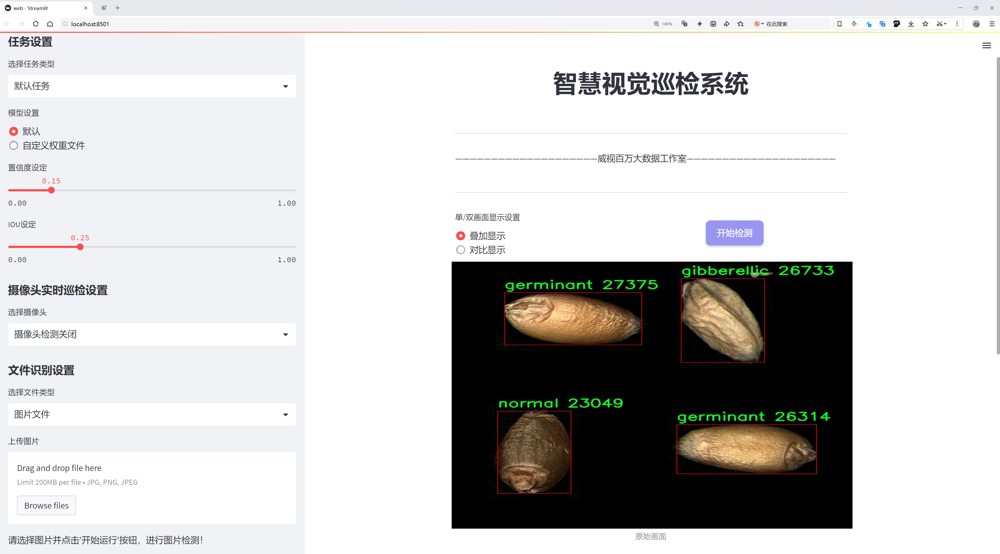
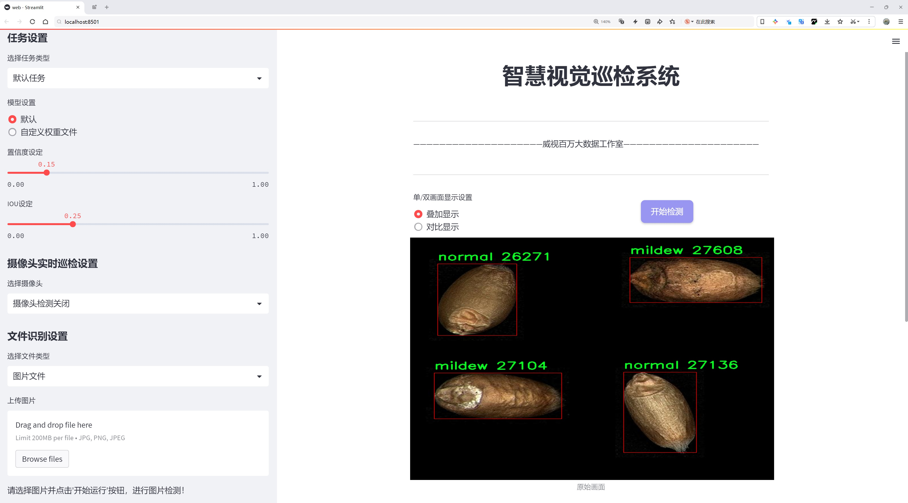
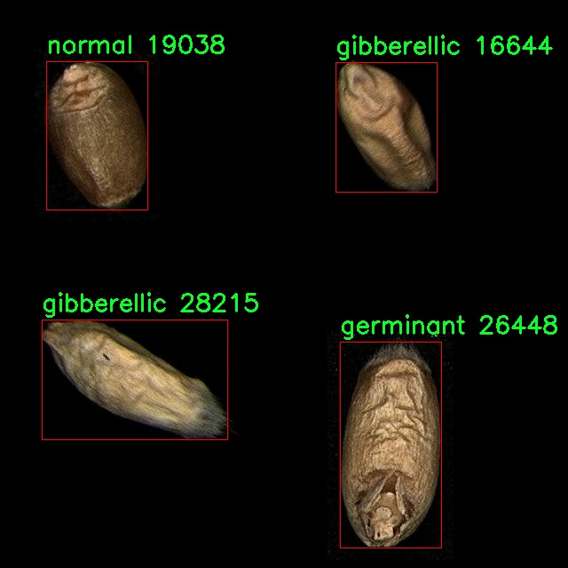
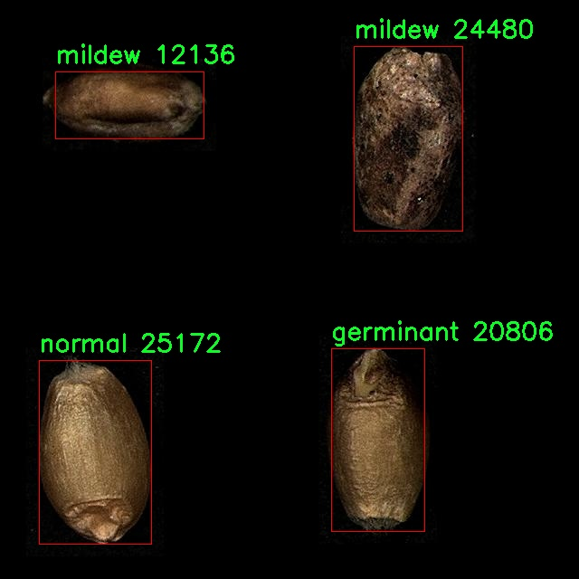
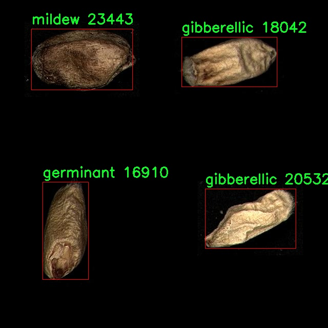
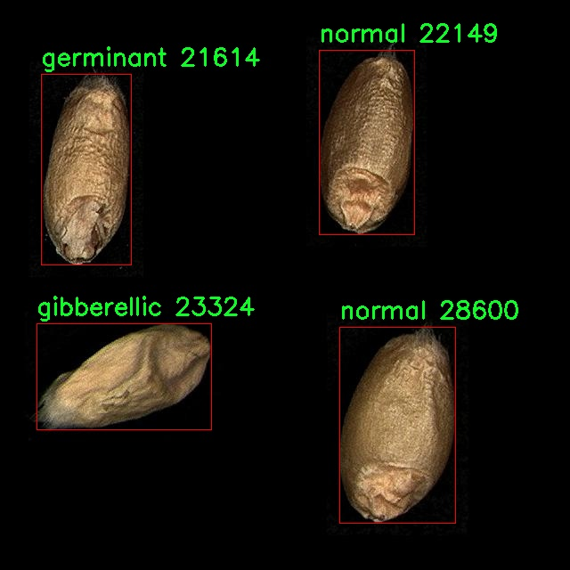
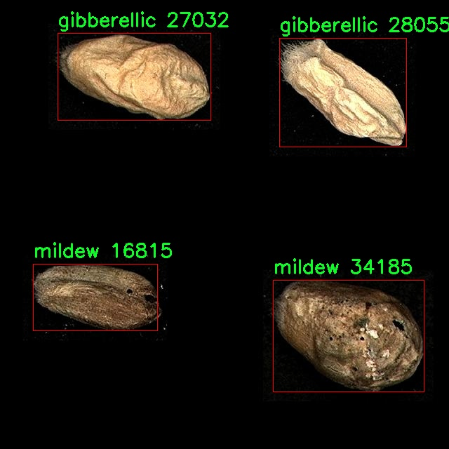

# 小麦生长状态检测检测系统源码分享
 # [一条龙教学YOLOV8标注好的数据集一键训练_70+全套改进创新点发刊_Web前端展示]

### 1.研究背景与意义

项目参考[AAAI Association for the Advancement of Artificial Intelligence](https://gitee.com/qunmasj/projects)

项目来源[AACV Association for the Advancement of Computer Vision](https://kdocs.cn/l/cszuIiCKVNis)

研究背景与意义

随着全球人口的不断增长，粮食安全问题日益凸显，尤其是小麦作为世界上最重要的粮食作物之一，其生长状态的监测与管理显得尤为重要。小麦的生长过程受到多种因素的影响，包括气候变化、土壤条件、病虫害等。因此，及时、准确地检测小麦的生长状态，不仅可以提高农业生产效率，还能有效减少资源浪费和环境污染。传统的小麦生长状态监测方法往往依赖于人工观察和经验判断，效率低下且容易受到主观因素的影响，难以满足现代农业的需求。

近年来，计算机视觉和深度学习技术的快速发展为农业监测提供了新的解决方案。特别是目标检测算法的进步，使得对作物生长状态的自动化监测成为可能。YOLO（You Only Look Once）系列算法因其高效的实时检测能力，逐渐成为目标检测领域的研究热点。YOLOv8作为该系列的最新版本，具有更高的检测精度和更快的处理速度，适合于复杂的农业环境中应用。然而，针对小麦生长状态的特定检测需求，YOLOv8仍需进行一定的改进和优化，以适应不同生长阶段和状态的识别。

本研究旨在基于改进的YOLOv8算法，构建一个小麦生长状态检测系统。为此，我们使用了“Wheat Pascal VOC”数据集，该数据集包含1700张图像，涵盖了小麦的四种生长状态：萌芽、赤霉病、霉变和正常。这些类别的多样性为模型的训练提供了丰富的样本，能够有效提升模型的泛化能力和检测准确性。通过对这些数据的深入分析和处理，我们希望能够识别出小麦在不同生长阶段的特征，进而实现对小麦生长状态的实时监测。

本研究的意义在于，首先，通过改进YOLOv8算法，可以提升小麦生长状态检测的准确性和实时性，为农业生产提供科学依据。其次，构建的小麦生长状态检测系统能够为农民和农业管理者提供有效的决策支持，帮助他们及时发现和处理小麦生长中的问题，降低病虫害对小麦产量的影响。此外，该系统的成功应用还将推动智能农业的发展，促进农业与信息技术的深度融合，提升农业生产的智能化水平。

综上所述，基于改进YOLOv8的小麦生长状态检测系统不仅具有重要的理论价值，也具备广泛的应用前景。通过该研究，我们期望能够为小麦的精准农业管理提供新的思路和方法，为实现可持续农业发展贡献力量。

### 2.图片演示







##### 注意：由于此博客编辑较早，上面“2.图片演示”和“3.视频演示”展示的系统图片或者视频可能为老版本，新版本在老版本的基础上升级如下：（实际效果以升级的新版本为准）

  （1）适配了YOLOV8的“目标检测”模型和“实例分割”模型，通过加载相应的权重（.pt）文件即可自适应加载模型。

  （2）支持“图片识别”、“视频识别”、“摄像头实时识别”三种识别模式。

  （3）支持“图片识别”、“视频识别”、“摄像头实时识别”三种识别结果保存导出，解决手动导出（容易卡顿出现爆内存）存在的问题，识别完自动保存结果并导出到tempDir中。

  （4）支持Web前端系统中的标题、背景图等自定义修改，后面提供修改教程。

  另外本项目提供训练的数据集和训练教程,暂不提供权重文件（best.pt）,需要您按照教程进行训练后实现图片演示和Web前端界面演示的效果。

### 3.视频演示

[3.1 视频演示](https://www.bilibili.com/video/BV1P9xPeCE4s/)

### 4.数据集信息展示

##### 4.1 本项目数据集详细数据（类别数＆类别名）

nc: 4
names: ['germinant', 'gibberellic', 'mildew', 'normal']


##### 4.2 本项目数据集信息介绍

数据集信息展示

在本研究中，我们使用了名为“Wheat Pascal VOC”的数据集，以支持改进YOLOv8的小麦生长状态检测系统的训练和评估。该数据集专门针对小麦生长过程中的不同状态进行了标注，旨在为农业领域的智能监测提供可靠的数据基础。数据集的类别数量为四个，具体包括：发芽状态（germinant）、赤霉素处理状态（gibberellic）、霉变状态（mildew）以及正常生长状态（normal）。这些类别的划分不仅反映了小麦在生长过程中的不同生理状态，也为后续的图像识别和分类任务提供了丰富的样本。

“Wheat Pascal VOC”数据集的构建过程经过精心设计，确保了样本的多样性和代表性。每个类别的样本均来自不同的生长环境和气候条件，以提高模型的泛化能力。例如，发芽状态的样本主要捕捉了小麦种子在土壤中萌发的初期阶段，图像中可以清晰地看到小麦的根系和嫩芽。赤霉素处理状态的样本则展示了施用植物生长调节剂后小麦的生长变化，这些图像能够帮助模型学习到化学处理对小麦生长的影响。霉变状态的样本则提供了小麦受到病害侵袭后的特征，通常表现为叶片的变色和枯萎，模型需要能够识别这些病害的早期迹象。正常生长状态的样本则作为对照，展示了健康小麦的生长特征，为模型提供了基准。

在数据集的标注过程中，采用了专业的农业专家进行审核，确保每个样本的标签准确无误。这种高质量的标注不仅提高了数据集的可信度，也为模型的训练提供了坚实的基础。数据集中的图像分辨率和质量经过精心选择，以确保在训练过程中，模型能够获取足够的细节信息，从而提升识别精度。

为了进一步增强模型的鲁棒性，数据集还进行了多种数据增强处理，包括旋转、缩放、翻转等操作。这些增强技术不仅增加了样本的多样性，还有效地防止了模型的过拟合现象，使得训练出的模型能够在实际应用中表现出更好的适应性和稳定性。

在使用“Wheat Pascal VOC”数据集进行YOLOv8模型的训练时，我们将重点关注模型在不同类别上的表现。通过分析模型在各个类别上的精确度和召回率，我们能够深入了解模型的优缺点，从而为后续的优化提供指导。此外，数据集的设计也为未来的研究提供了良好的基础，研究者可以在此基础上扩展更多的类别，或是引入新的生长状态，以进一步提升小麦生长状态检测系统的智能化水平。

总之，“Wheat Pascal VOC”数据集为改进YOLOv8的小麦生长状态检测系统提供了丰富的样本和坚实的理论基础，确保了模型在实际应用中的有效性和可靠性。通过对该数据集的深入分析和利用，我们期望能够为农业智能监测领域的发展贡献一份力量。











### 5.全套项目环境部署视频教程（零基础手把手教学）

[5.1 环境部署教程链接（零基础手把手教学）](https://www.ixigua.com/7404473917358506534?logTag=c807d0cbc21c0ef59de5)


[5.2 安装Python虚拟环境创建和依赖库安装视频教程链接（零基础手把手教学）](https://www.ixigua.com/7404474678003106304?logTag=1f1041108cd1f708b01a)

### 6.手把手YOLOV8训练视频教程（零基础小白有手就能学会）

[6.1 手把手YOLOV8训练视频教程（零基础小白有手就能学会）](https://www.ixigua.com/7404477157818401292?logTag=d31a2dfd1983c9668658)

### 7.70+种全套YOLOV8创新点代码加载调参视频教程（一键加载写好的改进模型的配置文件）

[7.1 70+种全套YOLOV8创新点代码加载调参视频教程（一键加载写好的改进模型的配置文件）](https://www.ixigua.com/7404478314661806627?logTag=29066f8288e3f4eea3a4)

### 8.70+种全套YOLOV8创新点原理讲解（非科班也可以轻松写刊发刊，V10版本正在科研待更新）

由于篇幅限制，每个创新点的具体原理讲解就不一一展开，具体见下列网址中的创新点对应子项目的技术原理博客网址【Blog】：


[8.1 70+种全套YOLOV8创新点原理讲解链接](https://gitee.com/qunmasj/good)

### 9.系统功能展示（检测对象为举例，实际内容以本项目数据集为准）

图9.1.系统支持检测结果表格显示

  图9.2.系统支持置信度和IOU阈值手动调节

  图9.3.系统支持自定义加载权重文件best.pt(需要你通过步骤5中训练获得)

  图9.4.系统支持摄像头实时识别

  图9.5.系统支持图片识别

  图9.6.系统支持视频识别

  图9.7.系统支持识别结果文件自动保存

  图9.8.系统支持Excel导出检测结果数据


### 10.原始YOLOV8算法原理

原始YOLOv8算法原理

YOLOv8是目标检测领域的最新进展，作为YOLO系列的第八个版本，它在设计上延续了前几代的优良传统，同时引入了一系列创新的技术和结构，以提高检测精度和速度。YOLOv8的架构主要由输入层、主干网络（Backbone）、颈部网络（Neck）和头部网络（Head）组成，每个部分都经过精心设计，以实现高效的特征提取和目标检测。

在YOLOv8中，输入图像首先被缩放到指定的尺寸，以适应网络的输入要求。接着，主干网络通过一系列卷积操作对图像进行下采样，提取出丰富的特征信息。主干网络的设计灵感来源于YOLOv5和YOLOv7，采用了C2f模块作为基本构成单元。C2f模块通过引入ELAN结构，增强了模型的梯度流动，解决了深层网络中常见的梯度消失问题。每个卷积层后面都包含批归一化和SiLU激活函数，这不仅提高了模型的非线性表达能力，还有效缓解了训练过程中的梯度爆炸和消失现象。

主干网络的末尾使用了快速空间金字塔池化（SPPFl）模块，该模块通过三个最大池化层处理多尺度特征，进一步增强了网络的特征抽象能力。这种设计使得YOLOv8能够更好地捕捉到不同尺度目标的特征信息，从而提高了目标检测的鲁棒性和准确性。

在特征融合方面，YOLOv8采用了PAN-FPN结构，充分利用了来自主干网络不同层次的特征图信息。颈部网络通过自下而上的融合方式，将高层特征与中层和浅层特征进行结合，确保了模型在处理不同尺度目标时的有效性。具体而言，YOLOv8在上采样阶段去掉了YOLOv5中的1x1卷积，直接将高层特征进行上采样后与中层特征进行拼接，形成了更加丰富的特征表示。

YOLOv8的头部网络则负责最终的目标检测和分类任务。与以往版本不同，YOLOv8采用了解耦的检测头设计，通过两个并行的卷积分支分别计算回归和分类的损失。这种解耦设计使得模型在处理目标检测时更加灵活，能够更好地适应不同类型的目标。头部网络输出的特征图具有多个尺度，分别为80x80、40x40和20x20，确保了模型在不同分辨率下的检测能力。

在损失函数的设计上，YOLOv8引入了VFLLoss作为分类损失，同时结合DFLLoss和CIoULoss来计算回归损失。这种组合损失函数能够有效处理样本不平衡问题，特别是在小目标检测时，能够显著提高模型的学习效果。此外，YOLOv8采用了Task-Aligned的样本匹配策略，进一步优化了训练过程中的样本分配。

值得一提的是，YOLOv8在网络结构上提供了多种变体，包括YOLOv8n、YOLOv8s、YOLOv8m、YOLOv8l和YOLOv8x，这些变体在主干网络的深度和残差块的数量上有所不同，用户可以根据具体应用场景选择合适的模型。

总的来说，YOLOv8在目标检测的各个环节都进行了深入的优化和创新，结合了多种先进的技术，旨在实现更高效、更准确的目标检测。其设计理念不仅继承了YOLO系列的优良传统，还通过引入新的模块和结构，推动了目标检测技术的发展。随着YOLOv8的推出，目标检测的应用场景将更加广泛，性能也将达到新的高度。


### 11.项目核心源码讲解（再也不用担心看不懂代码逻辑）

#### 11.1 ui.py

以下是经过简化和注释的核心代码部分：

```python
import sys
import subprocess
from QtFusion.path import abs_path

def run_script(script_path):
    """
    使用当前 Python 环境运行指定的脚本。

    Args:
        script_path (str): 要运行的脚本路径
    """
    # 获取当前 Python 解释器的路径
    python_path = sys.executable

    # 构建运行命令，使用 streamlit 运行指定的脚本
    command = f'"{python_path}" -m streamlit run "{script_path}"'

    # 执行命令并等待其完成
    result = subprocess.run(command, shell=True)
    
    # 检查命令执行结果，如果返回码不为0，则表示出错
    if result.returncode != 0:
        print("脚本运行出错。")

# 主程序入口
if __name__ == "__main__":
    # 获取要运行的脚本的绝对路径
    script_path = abs_path("web.py")

    # 调用函数运行指定的脚本
    run_script(script_path)
```

### 代码注释说明：
1. **导入模块**：
   - `sys`：用于获取当前 Python 解释器的路径。
   - `subprocess`：用于执行外部命令。
   - `abs_path`：从 `QtFusion.path` 导入的函数，用于获取文件的绝对路径。

2. **`run_script` 函数**：
   - 该函数接收一个脚本路径作为参数，并使用当前 Python 环境运行该脚本。
   - 使用 `sys.executable` 获取当前 Python 解释器的路径。
   - 构建命令字符串，使用 `streamlit` 模块运行指定的脚本。
   - 使用 `subprocess.run` 执行命令，并等待其完成。
   - 检查命令的返回码，如果不为0，打印错误信息。

3. **主程序入口**：
   - 使用 `if __name__ == "__main__":` 确保该代码块仅在直接运行该脚本时执行。
   - 调用 `abs_path` 函数获取 `web.py` 的绝对路径。
   - 调用 `run_script` 函数运行指定的脚本。

这个文件名为 `ui.py`，其主要功能是通过当前的 Python 环境来运行一个指定的脚本。代码首先导入了必要的模块，包括 `sys`、`os` 和 `subprocess`，以及一个自定义的 `abs_path` 函数，这个函数来自于 `QtFusion.path` 模块，可能用于获取文件的绝对路径。

在 `run_script` 函数中，首先定义了一个参数 `script_path`，它是要运行的脚本的路径。函数内部通过 `sys.executable` 获取当前 Python 解释器的路径，这样可以确保使用的是当前环境的 Python 版本。接着，构建了一个命令字符串，该命令用于运行 `streamlit`，这是一个用于构建和共享数据应用的库。命令的格式是将 Python 解释器与 `-m streamlit run` 和脚本路径组合在一起。

随后，使用 `subprocess.run` 方法执行这个命令。这个方法会在一个新的子进程中运行命令，并等待其完成。如果命令执行的返回码不为零，表示运行过程中出现了错误，程序会打印出“脚本运行出错”的提示。

在文件的最后部分，使用 `if __name__ == "__main__":` 语句来确保只有在直接运行该文件时才会执行后面的代码。这里指定了要运行的脚本路径为 `web.py`，并调用 `run_script` 函数来执行这个脚本。

总的来说，这个文件的主要作用是提供一个简单的接口，通过当前的 Python 环境来运行一个 Streamlit 应用脚本，并处理可能出现的错误。

#### 11.2 code\ultralytics\nn\autobackend.py

以下是代码中最核心的部分，并附上详细的中文注释：

```python
class AutoBackend(nn.Module):
    """
    处理Ultralytics YOLO模型的动态后端选择，用于推理。
    """

    @torch.no_grad()
    def __init__(self, weights="yolov8n.pt", device=torch.device("cpu"), fp16=False, verbose=True):
        """
        初始化AutoBackend以进行推理。

        参数:
            weights (str): 模型权重文件的路径，默认为'yolov8n.pt'。
            device (torch.device): 运行模型的设备，默认为CPU。
            fp16 (bool): 启用半精度推理，仅在特定后端支持。默认为False。
            verbose (bool): 启用详细日志记录。默认为True。
        """
        super().__init__()
        w = str(weights[0] if isinstance(weights, list) else weights)  # 确保权重是字符串
        # 确定模型类型
        pt, jit, onnx, xml, engine, coreml, saved_model, pb, tflite, edgetpu, tfjs, paddle, ncnn, triton = self._model_type(w)
        
        # 处理FP16和NHWC格式
        fp16 &= pt or jit or onnx or xml or engine  # FP16支持
        nhwc = coreml or saved_model or pb or tflite or edgetpu  # BHWC格式
        stride = 32  # 默认步幅
        model, metadata = None, None  # 初始化模型和元数据

        # 设置设备
        cuda = torch.cuda.is_available() and device.type != "cpu"  # 检查CUDA可用性
        if cuda and not any([pt, jit, engine, onnx]):  # 如果CUDA可用且模型格式不支持
            device = torch.device("cpu")  # 切换到CPU
            cuda = False

        # 加载模型
        if pt:  # PyTorch模型
            from ultralytics.nn.tasks import attempt_load_weights
            model = attempt_load_weights(weights, device=device, inplace=True)
        elif onnx:  # ONNX模型
            import onnxruntime
            session = onnxruntime.InferenceSession(w)
            output_names = [x.name for x in session.get_outputs()]
        # 其他模型格式的加载省略...

        # 检查和加载元数据
        if isinstance(metadata, (str, Path)) and Path(metadata).exists():
            metadata = yaml_load(metadata)  # 加载外部元数据YAML
        # 处理元数据...
        
        # 检查类名
        if "names" not in locals():  # 如果类名缺失
            names = default_class_names(data)  # 使用默认类名
        names = check_class_names(names)  # 检查类名有效性

        # 禁用梯度
        if pt:
            for p in model.parameters():
                p.requires_grad = False  # 禁用梯度计算

        self.__dict__.update(locals())  # 将所有局部变量分配给self

    def forward(self, im, augment=False, visualize=False):
        """
        在YOLOv8 MultiBackend模型上运行推理。

        参数:
            im (torch.Tensor): 要进行推理的图像张量。
            augment (bool): 是否在推理过程中进行数据增强，默认为False。
            visualize (bool): 是否可视化输出预测，默认为False。

        返回:
            (tuple): 包含原始输出张量和可视化处理输出的元组（如果visualize=True）。
        """
        b, ch, h, w = im.shape  # 获取输入图像的形状
        if self.fp16 and im.dtype != torch.float16:
            im = im.half()  # 转换为FP16
        if self.nhwc:
            im = im.permute(0, 2, 3, 1)  # 转换为NHWC格式

        # 根据模型类型进行推理
        if self.pt:  # PyTorch
            y = self.model(im, augment=augment, visualize=visualize)
        elif self.onnx:  # ONNX Runtime
            im = im.cpu().numpy()  # 转换为numpy数组
            y = self.session.run(self.output_names, {self.session.get_inputs()[0].name: im})
        # 其他模型推理省略...

        return self.from_numpy(y)  # 返回numpy数组转换为张量

    def from_numpy(self, x):
        """
        将numpy数组转换为张量。

        参数:
            x (np.ndarray): 要转换的数组。

        返回:
            (torch.Tensor): 转换后的张量。
        """
        return torch.tensor(x).to(self.device) if isinstance(x, np.ndarray) else x

    @staticmethod
    def _model_type(p="path/to/model.pt"):
        """
        根据模型文件路径返回模型类型。

        参数:
            p: 模型文件的路径，默认为'path/to/model.pt'。
        """
        from ultralytics.engine.exporter import export_formats
        sf = list(export_formats().Suffix)  # 获取支持的后缀
        name = Path(p).name
        types = [s in name for s in sf]  # 检查文件名中是否包含支持的后缀
        return types  # 返回模型类型
```

### 代码说明
1. **AutoBackend类**: 该类用于处理不同格式的YOLO模型的推理。它根据模型文件的后缀动态选择合适的推理后端。
2. **__init__方法**: 初始化模型，设置设备，并加载模型权重。支持多种模型格式（如PyTorch、ONNX等）。
3. **forward方法**: 进行推理操作，接受输入图像并返回推理结果。
4. **from_numpy方法**: 将numpy数组转换为PyTorch张量。
5. **_model_type静态方法**: 根据模型文件路径返回模型的类型，帮助识别支持的模型格式。

这个程序文件是Ultralytics YOLO模型的一个核心部分，主要负责动态选择后端以进行推理。它支持多种模型格式，包括PyTorch、ONNX、TensorFlow等，能够根据输入的模型格式自动选择合适的推理引擎。

文件首先导入了一些必要的库和模块，包括Python标准库中的一些模块以及用于深度学习的PyTorch和OpenCV等库。接着定义了一些辅助函数，比如`check_class_names`和`default_class_names`，用于验证和返回类名。

`AutoBackend`类是这个文件的核心。它继承自`torch.nn.Module`，用于处理不同后端的推理。类的构造函数接受多个参数，包括模型权重路径、设备类型、是否使用DNN模块、数据文件路径等。根据输入的模型格式，构造函数会加载相应的模型并进行初始化。

在模型加载过程中，程序会根据模型的后缀名来判断其类型，并执行相应的加载逻辑。例如，对于PyTorch模型，使用`attempt_load_weights`函数加载权重；对于ONNX模型，使用OpenCV的DNN模块或ONNX Runtime进行加载；对于TensorRT模型，使用TensorRT的API进行加载等。

此外，类中还定义了`forward`方法，该方法用于执行推理。它接收一个图像张量，并根据当前模型的类型进行相应的推理操作。推理结果可以是原始输出张量，也可以是经过处理的可视化输出。

`warmup`方法用于在模型上运行一次前向传递，以便进行热身，确保模型在实际推理时能够快速响应。

最后，`_model_type`静态方法用于根据模型文件路径返回模型的类型。这一方法通过检查文件后缀来判断模型类型，并支持从URL加载模型。

总体而言，这个文件提供了一个灵活的框架，允许用户在不同的深度学习后端之间切换，从而实现YOLO模型的高效推理。

#### 11.3 code\ultralytics\utils\files.py

以下是代码中最核心的部分，并附上详细的中文注释：

```python
import os
from pathlib import Path
from contextlib import contextmanager

@contextmanager
def spaces_in_path(path):
    """
    处理路径中包含空格的上下文管理器。如果路径包含空格，则用下划线替换它们，
    复制文件/目录到新路径，执行上下文代码块，然后将文件/目录复制回原位置。

    参数:
        path (str | Path): 原始路径。

    返回:
        (Path): 如果路径中有空格，则返回替换下划线的临时路径，否则返回原始路径。
    """
    if " " in str(path):
        path = Path(path)  # 将路径转换为Path对象
        with tempfile.TemporaryDirectory() as tmp_dir:  # 创建临时目录
            tmp_path = Path(tmp_dir) / path.name.replace(" ", "_")  # 替换空格并构造新路径

            # 复制文件/目录
            if path.is_dir():
                shutil.copytree(path, tmp_path)  # 复制目录
            elif path.is_file():
                shutil.copy2(path, tmp_path)  # 复制文件

            try:
                yield tmp_path  # 返回临时路径
            finally:
                # 将文件/目录复制回原位置
                if tmp_path.is_dir():
                    shutil.copytree(tmp_path, path, dirs_exist_ok=True)
                elif tmp_path.is_file():
                    shutil.copy2(tmp_path, path)

    else:
        yield path  # 如果没有空格，直接返回原始路径


def increment_path(path, exist_ok=False, sep="", mkdir=False):
    """
    增加文件或目录路径，即将路径递增，例如 runs/exp --> runs/exp{sep}2, runs/exp{sep}3 等。

    如果路径存在且exist_ok未设置为True，则通过在路径末尾附加数字和分隔符来递增路径。
    如果路径是文件，则保留文件扩展名；如果路径是目录，则直接在路径末尾附加数字。
    如果mkdir设置为True，则如果路径不存在，则创建该路径。

    参数:
        path (str, pathlib.Path): 要递增的路径。
        exist_ok (bool, optional): 如果为True，则路径不会递增，直接返回原路径。默认为False。
        sep (str, optional): 路径和递增数字之间使用的分隔符。默认为''。
        mkdir (bool, optional): 如果路径不存在，则创建目录。默认为False。

    返回:
        (pathlib.Path): 递增后的路径。
    """
    path = Path(path)  # 将路径转换为Path对象
    if path.exists() and not exist_ok:
        path, suffix = (path.with_suffix(""), path.suffix) if path.is_file() else (path, "")

        # 递增路径
        for n in range(2, 9999):
            p = f"{path}{sep}{n}{suffix}"  # 生成新的路径
            if not os.path.exists(p):
                break
        path = Path(p)

    if mkdir:
        path.mkdir(parents=True, exist_ok=True)  # 创建目录

    return path  # 返回递增后的路径
```

### 代码说明：
1. **spaces_in_path**: 这是一个上下文管理器，用于处理路径中包含空格的情况。它会创建一个临时路径，替换空格为下划线，并在执行完代码块后将文件或目录复制回原位置。
  
2. **increment_path**: 这个函数用于递增文件或目录的路径。如果指定的路径已经存在，它会在路径后附加一个数字（如 `exp2`、`exp3` 等），并返回新的路径。还可以选择创建目录。

这个程序文件 `code\ultralytics\utils\files.py` 是一个用于处理文件和目录的实用工具，主要用于支持 Ultralytics YOLO 项目。代码中包含了多个功能函数和一个上下文管理器，下面是对代码的详细说明。

首先，文件引入了一些必要的库，包括 `contextlib`、`glob`、`os`、`shutil`、`tempfile`、`datetime` 和 `pathlib`。这些库提供了文件和目录操作、时间处理等功能。

接下来定义了一个 `WorkingDirectory` 类，它是一个上下文管理器，用于在特定的上下文中更改当前工作目录。这个类在初始化时接收一个新的目录路径 `new_dir`，并在进入上下文时使用 `os.chdir()` 方法更改当前工作目录，在退出上下文时恢复到原来的工作目录。这种设计使得在特定的代码块中可以方便地使用不同的工作目录。

然后定义了一个 `spaces_in_path` 的上下文管理器，用于处理路径中包含空格的情况。如果路径中包含空格，它会将空格替换为下划线，并将文件或目录复制到一个临时路径中执行代码块，最后再将文件或目录复制回原来的位置。这种方法可以避免因为路径中有空格而导致的潜在问题。

接下来是 `increment_path` 函数，它用于递增文件或目录的路径。如果指定的路径已经存在且 `exist_ok` 参数为 `False`，则会在路径后附加一个数字（例如 `runs/exp2`、`runs/exp3` 等）。如果路径是文件，文件扩展名会被保留；如果是目录，则直接在路径后添加数字。如果 `mkdir` 参数为 `True`，则会在路径不存在时创建该目录。

`file_age` 函数返回自上次文件更新以来的天数。它通过获取文件的最后修改时间并与当前时间进行比较来计算天数。

`file_date` 函数返回文件的可读修改日期，格式为 `'YYYY-MM-DD'`，同样是通过获取文件的最后修改时间来实现的。

`file_size` 函数用于返回文件或目录的大小（以 MB 为单位）。如果输入的是文件，它会返回文件的大小；如果输入的是目录，它会递归计算目录中所有文件的总大小。

最后，`get_latest_run` 函数用于返回指定目录中最新的 `last.pt` 文件的路径。它使用 `glob` 模块查找所有匹配的文件，并通过 `os.path.getctime` 获取创建时间来确定最新的文件。

整体来看，这个文件提供了一系列方便的工具函数和上下文管理器，旨在简化文件和目录的操作，尤其是在处理与 Ultralytics YOLO 相关的任务时。

#### 11.4 70+种YOLOv8算法改进源码大全和调试加载训练教程（非必要）\ultralytics\utils\metrics.py

以下是代码中最核心的部分，并附上详细的中文注释：

```python
import numpy as np
import torch

def box_iou(box1, box2, eps=1e-7):
    """
    计算两个边界框之间的交并比（IoU）。
    
    Args:
        box1 (torch.Tensor): 形状为 (N, 4) 的张量，表示 N 个边界框。
        box2 (torch.Tensor): 形状为 (M, 4) 的张量，表示 M 个边界框。
        eps (float, optional): 避免除以零的小值。默认值为 1e-7。

    Returns:
        (torch.Tensor): 形状为 (N, M) 的张量，包含 box1 和 box2 中每对边界框的 IoU 值。
    """
    # 获取边界框的坐标
    (a1, a2), (b1, b2) = box1.unsqueeze(1).chunk(2, 2), box2.unsqueeze(0).chunk(2, 2)
    
    # 计算交集区域
    inter = (torch.min(a2, b2) - torch.max(a1, b1)).clamp_(0).prod(2)

    # 计算并集区域
    return inter / ((a2 - a1).prod(2) + (b2 - b1).prod(2) - inter + eps)

def bbox_iou(box1, box2, xywh=True, eps=1e-7):
    """
    计算边界框之间的交并比（IoU），支持 (x, y, w, h) 和 (x1, y1, x2, y2) 格式。
    
    Args:
        box1 (torch.Tensor): 形状为 (1, 4) 的张量，表示单个边界框。
        box2 (torch.Tensor): 形状为 (n, 4) 的张量，表示 n 个边界框。
        xywh (bool, optional): 如果为 True，输入框为 (x, y, w, h) 格式；如果为 False，输入框为 (x1, y1, x2, y2) 格式。默认值为 True。
        eps (float, optional): 避免除以零的小值。默认值为 1e-7。

    Returns:
        (torch.Tensor): 计算得到的 IoU 值。
    """
    # 将 (x, y, w, h) 转换为 (x1, y1, x2, y2) 格式
    if xywh:
        (x1, y1, w1, h1), (x2, y2, w2, h2) = box1.chunk(4, -1), box2.chunk(4, -1)
        b1_x1, b1_x2, b1_y1, b1_y2 = x1 - w1 / 2, x1 + w1 / 2, y1 - h1 / 2, y1 + h1 / 2
        b2_x1, b2_x2, b2_y1, b2_y2 = x2 - w2 / 2, x2 + w2 / 2, y2 - h2 / 2, y2 + h2 / 2
    else:
        b1_x1, b1_y1, b1_x2, b1_y2 = box1.chunk(4, -1)
        b2_x1, b2_y1, b2_x2, b2_y2 = box2.chunk(4, -1)

    # 计算交集区域
    inter = (b1_x2.minimum(b2_x2) - b1_x1.maximum(b2_x1)).clamp_(0) * \
            (b1_y2.minimum(b2_y2) - b1_y1.maximum(b2_y1)).clamp_(0)

    # 计算并集区域
    union = (b1_x2 - b1_x1).prod() + (b2_x2 - b2_x1).prod() - inter + eps

    # 返回 IoU 值
    return inter / union

def compute_ap(recall, precision):
    """
    计算给定召回率和精确率曲线的平均精度（AP）。
    
    Args:
        recall (list): 召回率曲线。
        precision (list): 精确率曲线。

    Returns:
        (float): 平均精度。
        (np.ndarray): 精确率包络曲线。
        (np.ndarray): 修改后的召回率曲线，前后添加了哨兵值。
    """
    # 在开头和结尾添加哨兵值
    mrec = np.concatenate(([0.0], recall, [1.0]))
    mpre = np.concatenate(([1.0], precision, [0.0]))

    # 计算精确率包络
    mpre = np.flip(np.maximum.accumulate(np.flip(mpre)))

    # 计算曲线下面积
    x = np.linspace(0, 1, 101)  # 101点插值（COCO）
    ap = np.trapz(np.interp(x, mrec, mpre), x)  # 积分

    return ap, mpre, mrec
```

### 代码核心部分说明：
1. **box_iou**：计算两个边界框之间的交并比（IoU），返回一个形状为 (N, M) 的张量，表示每对边界框的 IoU 值。
2. **bbox_iou**：支持两种格式的边界框输入，计算单个边界框与多个边界框之间的 IoU。
3. **compute_ap**：计算给定召回率和精确率曲线的平均精度（AP），并返回相关的曲线数据。

这些函数是目标检测中评估模型性能的关键，能够帮助我们量化模型的检测能力。

这个程序文件是用于计算和更新YOLOv8模型的各种评估指标的。它主要包括与目标检测、分类、分割和姿态估计相关的函数和类。文件的结构和功能如下：

首先，文件导入了一些必要的库，如`math`、`warnings`、`Path`、`matplotlib`、`numpy`和`torch`，这些库提供了数学计算、警告处理、路径操作、绘图、数组处理和深度学习的支持。

接下来，定义了一些计算框架的核心函数，包括计算交并比（IoU）和其他相关指标的函数。`bbox_ioa`函数计算给定两个边界框的交集与第二个框的面积的比值，`box_iou`函数计算两个边界框之间的IoU。`bbox_iou`函数则支持多种IoU计算方式，包括标准IoU、广义IoU（GIoU）、距离IoU（DIoU）、完全IoU（CIoU）等。

文件中还定义了用于计算混淆矩阵的`ConfusionMatrix`类，该类用于更新和处理目标检测和分类任务的混淆矩阵。它提供了方法来处理分类预测、更新检测批次的混淆矩阵、绘制混淆矩阵等。

`Metric`类用于计算YOLOv8模型的评估指标，包括精度、召回率和平均精度（AP）。它提供了多种方法来获取不同的指标值，如`ap50`、`map`等，并支持更新和存储新的评估结果。

`DetMetrics`和`SegmentMetrics`类则分别用于计算目标检测和分割任务的指标。它们封装了计算过程，并提供了方便的方法来获取各类指标的结果。

此外，文件中还包含了一些用于绘制精度-召回曲线、混淆矩阵和其他可视化结果的函数。这些函数利用`matplotlib`库来生成和保存图形。

总的来说，这个文件为YOLOv8模型提供了全面的评估指标计算和可视化支持，帮助用户更好地理解模型的性能。

#### 11.5 70+种YOLOv8算法改进源码大全和调试加载训练教程（非必要）\ultralytics\trackers\utils\kalman_filter.py

以下是经过简化和注释的核心代码部分，保留了卡尔曼滤波器的基本功能和逻辑。

```python
import numpy as np
import scipy.linalg

class KalmanFilter:
    """
    卡尔曼滤波器，用于跟踪图像空间中的边界框。
    状态空间包含边界框中心位置 (x, y)、宽度 w、高度 h 及其各自的速度。
    运动模型遵循恒定速度模型。
    """

    def __init__(self):
        """初始化卡尔曼滤波器的模型矩阵。"""
        ndim, dt = 4, 1.  # 状态维度和时间步长

        # 创建状态转移矩阵
        self._motion_mat = np.eye(2 * ndim, 2 * ndim)  # 2 * ndim 是状态向量的维度
        for i in range(ndim):
            self._motion_mat[i, ndim + i] = dt  # 设置速度部分的转移

        # 观测矩阵
        self._update_mat = np.eye(ndim, 2 * ndim)

        # 运动和观测的不确定性权重
        self._std_weight_position = 1. / 20
        self._std_weight_velocity = 1. / 160

    def initiate(self, measurement):
        """
        从未关联的测量值创建跟踪。

        参数
        ----------
        measurement : ndarray
            边界框坐标 (x, y, w, h)。

        返回
        -------
        (ndarray, ndarray)
            返回新的跟踪的均值向量和协方差矩阵。
        """
        mean_pos = measurement  # 位置均值
        mean_vel = np.zeros_like(mean_pos)  # 速度均值初始化为0
        mean = np.r_[mean_pos, mean_vel]  # 合并位置和速度均值

        # 计算协方差矩阵的标准差
        std = [
            2 * self._std_weight_position * measurement[2],  # 宽度
            2 * self._std_weight_position * measurement[3],  # 高度
            10 * self._std_weight_velocity * measurement[2],  # 速度标准差
            10 * self._std_weight_velocity * measurement[3]
        ]
        covariance = np.diag(np.square(std))  # 生成对角协方差矩阵
        return mean, covariance

    def predict(self, mean, covariance):
        """
        运行卡尔曼滤波器的预测步骤。

        参数
        ----------
        mean : ndarray
            上一时间步的状态均值向量。
        covariance : ndarray
            上一时间步的状态协方差矩阵。

        返回
        -------
        (ndarray, ndarray)
            返回预测状态的均值和协方差矩阵。
        """
        # 计算运动协方差
        std_pos = [self._std_weight_position * mean[2], self._std_weight_position * mean[3]]
        std_vel = [self._std_weight_velocity * mean[2], self._std_weight_velocity * mean[3]]
        motion_cov = np.diag(np.square(np.r_[std_pos, std_vel]))

        # 更新均值和协方差
        mean = np.dot(mean, self._motion_mat.T)
        covariance = np.linalg.multi_dot((self._motion_mat, covariance, self._motion_mat.T)) + motion_cov

        return mean, covariance

    def update(self, mean, covariance, measurement):
        """
        运行卡尔曼滤波器的校正步骤。

        参数
        ----------
        mean : ndarray
            预测状态的均值向量。
        covariance : ndarray
            状态的协方差矩阵。
        measurement : ndarray
            测量向量 (x, y, w, h)。

        返回
        -------
        (ndarray, ndarray)
            返回测量校正后的状态分布。
        """
        # 投影到测量空间
        projected_mean, projected_cov = self.project(mean, covariance)

        # 计算卡尔曼增益
        chol_factor, lower = scipy.linalg.cho_factor(projected_cov, lower=True)
        kalman_gain = scipy.linalg.cho_solve((chol_factor, lower),
                                             np.dot(covariance, self._update_mat.T).T).T
        innovation = measurement - projected_mean  # 计算创新

        # 更新均值和协方差
        new_mean = mean + np.dot(innovation, kalman_gain.T)
        new_covariance = covariance - np.linalg.multi_dot((kalman_gain, projected_cov, kalman_gain.T))
        return new_mean, new_covariance

    def project(self, mean, covariance):
        """
        将状态分布投影到测量空间。

        参数
        ----------
        mean : ndarray
            状态的均值向量。
        covariance : ndarray
            状态的协方差矩阵。

        返回
        -------
        (ndarray, ndarray)
            返回投影后的均值和协方差矩阵。
        """
        std = [self._std_weight_position * mean[2], self._std_weight_position * mean[3]]
        innovation_cov = np.diag(np.square(std))

        mean = np.dot(self._update_mat, mean)
        covariance = np.linalg.multi_dot((self._update_mat, covariance, self._update_mat.T))
        return mean, covariance + innovation_cov
```

### 代码说明
1. **类定义**：`KalmanFilter` 类实现了卡尔曼滤波器的基本功能，用于跟踪图像中的物体。
2. **初始化**：在 `__init__` 方法中，定义了状态转移矩阵和观测矩阵，并设置了运动和观测的不确定性权重。
3. **初始化跟踪**：`initiate` 方法用于从测量值创建新的跟踪对象，返回初始的均值和协方差矩阵。
4. **预测步骤**：`predict` 方法根据当前状态均值和协方差预测下一个状态。
5. **更新步骤**：`update` 方法根据新的测量值更新状态均值和协方差。
6. **投影到测量空间**：`project` 方法将状态分布投影到测量空间，以便进行更新。

以上代码实现了卡尔曼滤波器的核心功能，适用于边界框的跟踪任务。

这个程序文件实现了一个简单的卡尔曼滤波器，用于在图像空间中跟踪边界框。卡尔曼滤波器是一种递归滤波器，广泛应用于估计动态系统的状态。该文件中定义了两个类：`KalmanFilterXYAH`和`KalmanFilterXYWH`，分别用于处理不同的边界框表示方式。

`KalmanFilterXYAH`类用于处理包含边界框中心位置（x, y）、纵横比（a）和高度（h）的状态表示。其状态空间是8维的，包含位置、纵横比、高度及其对应的速度。初始化时，类构造函数创建了运动模型矩阵和观测模型矩阵，并设定了运动和观测的不确定性权重。

在`initiate`方法中，输入一个测量值（边界框坐标），生成一个新的跟踪对象的均值向量和协方差矩阵。均值向量由测量值和初始化的速度组成，协方差矩阵则根据测量的不确定性计算得出。

`predict`方法执行卡尔曼滤波的预测步骤，基于前一时刻的状态均值和协方差，预测当前时刻的状态。`project`方法将状态分布投影到测量空间，以便进行更新。`update`方法则执行卡尔曼滤波的校正步骤，通过测量值来修正预测的状态。

`gating_distance`方法计算状态分布与测量值之间的距离，使用马氏距离（Mahalanobis distance）来评估测量值的有效性。

`KalmanFilterXYWH`类是`KalmanFilterXYAH`的子类，专门用于处理包含边界框中心位置（x, y）、宽度（w）和高度（h）的状态表示。它重写了`initiate`、`predict`和`project`方法，以适应新的状态表示方式。`update`方法则直接调用父类的方法进行更新。

整体来看，这个文件实现了卡尔曼滤波器的基本功能，适用于目标跟踪任务，通过对边界框的动态特性建模，能够有效地估计目标的位置和运动状态。

#### 11.6 train.py

以下是代码中最核心的部分，并附上详细的中文注释：

```python
class DetectionTrainer(BaseTrainer):
    """
    DetectionTrainer类，继承自BaseTrainer类，用于基于检测模型的训练。
    """

    def build_dataset(self, img_path, mode="train", batch=None):
        """
        构建YOLO数据集。

        参数:
            img_path (str): 包含图像的文件夹路径。
            mode (str): 模式，可以是'train'或'val'，用户可以为每种模式自定义不同的数据增强。
            batch (int, optional): 批次大小，仅用于'rect'模式。默认为None。
        """
        gs = max(int(de_parallel(self.model).stride.max() if self.model else 0), 32)
        return build_yolo_dataset(self.args, img_path, batch, self.data, mode=mode, rect=mode == "val", stride=gs)

    def get_dataloader(self, dataset_path, batch_size=16, rank=0, mode="train"):
        """构造并返回数据加载器。"""
        assert mode in ["train", "val"]  # 确保模式是'train'或'val'
        with torch_distributed_zero_first(rank):  # 仅在DDP情况下初始化数据集*.cache一次
            dataset = self.build_dataset(dataset_path, mode, batch_size)  # 构建数据集
        shuffle = mode == "train"  # 训练模式下打乱数据
        if getattr(dataset, "rect", False) and shuffle:
            LOGGER.warning("WARNING ⚠️ 'rect=True'与DataLoader的shuffle不兼容，设置shuffle=False")
            shuffle = False
        workers = self.args.workers if mode == "train" else self.args.workers * 2  # 设置工作线程数
        return build_dataloader(dataset, batch_size, workers, shuffle, rank)  # 返回数据加载器

    def preprocess_batch(self, batch):
        """对一批图像进行预处理，包括缩放和转换为浮点数。"""
        batch["img"] = batch["img"].to(self.device, non_blocking=True).float() / 255  # 将图像转换为浮点数并归一化
        if self.args.multi_scale:  # 如果启用多尺度
            imgs = batch["img"]
            sz = (
                random.randrange(self.args.imgsz * 0.5, self.args.imgsz * 1.5 + self.stride)
                // self.stride
                * self.stride
            )  # 随机选择图像大小
            sf = sz / max(imgs.shape[2:])  # 计算缩放因子
            if sf != 1:  # 如果缩放因子不为1
                ns = [
                    math.ceil(x * sf / self.stride) * self.stride for x in imgs.shape[2:]
                ]  # 计算新的形状
                imgs = nn.functional.interpolate(imgs, size=ns, mode="bilinear", align_corners=False)  # 进行插值
            batch["img"] = imgs  # 更新图像
        return batch

    def get_model(self, cfg=None, weights=None, verbose=True):
        """返回YOLO检测模型。"""
        model = DetectionModel(cfg, nc=self.data["nc"], verbose=verbose and RANK == -1)  # 创建检测模型
        if weights:
            model.load(weights)  # 加载权重
        return model

    def get_validator(self):
        """返回用于YOLO模型验证的DetectionValidator。"""
        self.loss_names = "box_loss", "cls_loss", "dfl_loss"  # 定义损失名称
        return yolo.detect.DetectionValidator(
            self.test_loader, save_dir=self.save_dir, args=copy(self.args), _callbacks=self.callbacks
        )  # 返回验证器

    def plot_training_samples(self, batch, ni):
        """绘制带有注释的训练样本。"""
        plot_images(
            images=batch["img"],
            batch_idx=batch["batch_idx"],
            cls=batch["cls"].squeeze(-1),
            bboxes=batch["bboxes"],
            paths=batch["im_file"],
            fname=self.save_dir / f"train_batch{ni}.jpg",
            on_plot=self.on_plot,
        )  # 绘制图像

    def plot_metrics(self):
        """从CSV文件中绘制指标。"""
        plot_results(file=self.csv, on_plot=self.on_plot)  # 保存结果图
```

### 代码核心部分说明：
1. **DetectionTrainer类**：该类是用于训练YOLO检测模型的核心类，继承自`BaseTrainer`。
2. **build_dataset方法**：用于构建YOLO数据集，支持训练和验证模式，并根据模式应用不同的数据增强。
3. **get_dataloader方法**：构造数据加载器，确保在分布式训练中只初始化一次数据集。
4. **preprocess_batch方法**：对输入的图像批次进行预处理，包括归一化和多尺度调整。
5. **get_model方法**：返回一个YOLO检测模型，可以选择加载预训练权重。
6. **get_validator方法**：返回一个用于模型验证的验证器。
7. **plot_training_samples和plot_metrics方法**：用于可视化训练样本和训练指标，帮助监控训练过程。

这个程序文件 `train.py` 是一个用于训练 YOLO（You Only Look Once）目标检测模型的脚本，继承自 `BaseTrainer` 类。它包含了一系列方法，旨在构建数据集、获取数据加载器、预处理图像批次、设置模型属性、获取模型、验证模型、记录损失、显示训练进度、绘制训练样本和绘制训练指标等功能。

在文件的开头，导入了一些必要的库和模块，包括数学运算、随机数生成、深度学习相关的库（如 PyTorch）以及 YOLO 模型和数据处理的工具。接着定义了 `DetectionTrainer` 类，这个类专门用于基于检测模型的训练。

`build_dataset` 方法用于构建 YOLO 数据集，接受图像路径、模式（训练或验证）和批次大小作为参数。它会根据模型的步幅（stride）来确定图像的处理方式，并调用 `build_yolo_dataset` 函数来实际构建数据集。

`get_dataloader` 方法则用于构建数据加载器，确保在分布式训练时只初始化一次数据集。它根据模式决定是否打乱数据，并设置工作线程的数量。

`preprocess_batch` 方法负责对图像批次进行预处理，包括将图像缩放到合适的大小并转换为浮点数格式。该方法还支持多尺度训练，通过随机选择图像大小来增强模型的鲁棒性。

`set_model_attributes` 方法用于设置模型的属性，包括类别数量和类别名称等，以确保模型与数据集的一致性。

`get_model` 方法返回一个 YOLO 检测模型实例，并可选择加载预训练权重。

`get_validator` 方法返回一个用于验证 YOLO 模型的验证器，能够在训练后评估模型的性能。

`label_loss_items` 方法用于返回带有标签的训练损失项字典，方便记录和监控训练过程中的损失变化。

`progress_string` 方法返回一个格式化的字符串，显示训练进度，包括当前的轮次、GPU 内存使用情况、损失值、实例数量和图像大小等信息。

`plot_training_samples` 方法用于绘制训练样本及其标注，便于可视化训练数据的质量。

最后，`plot_metrics` 和 `plot_training_labels` 方法分别用于绘制训练过程中记录的指标和训练标签的可视化，帮助用户更好地理解模型的训练效果。

整体来看，这个程序文件提供了一个完整的训练框架，涵盖了从数据准备到模型训练和评估的各个方面，为使用 YOLO 进行目标检测提供了便利。

### 12.系统整体结构（节选）

### 整体功能和构架概括

该项目是一个基于YOLO（You Only Look Once）算法的目标检测框架，旨在提供一个完整的训练、评估和推理流程。项目的主要功能包括模型的训练、验证、评估、数据处理和可视化等。通过不同的模块和工具，用户可以方便地进行模型的构建、训练和调试。

项目的整体架构可以分为以下几个主要部分：

1. **用户界面（UI）**：提供一个简单的接口来运行和管理模型训练和推理过程。
2. **模型定义与后端选择**：实现YOLO模型的定义和动态选择后端进行推理。
3. **数据处理工具**：提供数据集构建、文件操作和预处理功能。
4. **评估指标计算**：实现目标检测和分类任务的评估指标计算。
5. **卡尔曼滤波器**：用于目标跟踪的状态估计。
6. **训练框架**：实现模型的训练、验证和可视化功能。

### 文件功能整理表

| 文件路径                                                                                         | 功能描述                                                         |
|--------------------------------------------------------------------------------------------------|------------------------------------------------------------------|
| `D:\tools\20240809\code\ui.py`                                                                  | 提供一个接口，通过当前Python环境运行指定的Streamlit脚本。        |
| `D:\tools\20240809\code\code\ultralytics\nn\autobackend.py`                                   | 动态选择后端以进行YOLO模型推理，支持多种模型格式。              |
| `D:\tools\20240809\code\code\ultralytics\utils\files.py`                                     | 提供文件和目录操作的工具函数，包括数据集构建和路径处理。        |
| `D:\tools\20240809\code\70+种YOLOv8算法改进源码大全和调试加载训练教程（非必要）\ultralytics\utils\metrics.py` | 计算和更新YOLO模型的评估指标，支持混淆矩阵和可视化。            |
| `D:\tools\20240809\code\70+种YOLOv8算法改进源码大全和调试加载训练教程（非必要）\ultralytics\trackers\utils\kalman_filter.py` | 实现卡尔曼滤波器，用于目标跟踪的状态估计。                      |
| `D:\tools\20240809\code\train.py`                                                               | 训练YOLO模型的主脚本，包含数据集构建、模型训练和评估功能。      |
| `D:\tools\20240809\code\70+种YOLOv8算法改进源码大全和调试加载训练教程（非必要）\ultralytics\engine\__init__.py` | 初始化引擎模块，可能包含模型训练和推理的核心逻辑。              |
| `D:\tools\20240809\code\70+种YOLOv8算法改进源码大全和调试加载训练教程（非必要）\ultralytics\nn\modules\utils.py` | 提供YOLO模型的辅助功能和工具函数。                              |
| `D:\tools\20240809\code\70+种YOLOv8算法改进源码大全和调试加载训练教程（非必要）\ultralytics\models\yolo\classify\__init__.py` | 初始化分类模型模块，可能包含分类相关的模型定义和功能。          |
| `D:\tools\20240809\code\code\ultralytics\utils\callbacks\tensorboard.py`                     | 提供与TensorBoard集成的回调函数，用于可视化训练过程。            |
| `D:\tools\20240809\code\code\ultralytics\models\yolo\pose\train.py`                          | 训练YOLO姿态估计模型的脚本，包含姿态估计相关的训练逻辑。        |
| `D:\tools\20240809\code\code\ultralytics\utils\callbacks\wb.py`                              | 提供与Weights & Biases集成的回调函数，用于实验跟踪和可视化。    |
| `D:\tools\20240809\code\70+种YOLOv8算法改进源码大全和调试加载训练教程（非必要）\ultralytics\engine\validator.py` | 实现模型验证逻辑，评估训练后的模型性能。                        |

以上表格总结了项目中各个文件的主要功能，帮助用户快速了解每个模块的作用和使用场景。

注意：由于此博客编辑较早，上面“11.项目核心源码讲解（再也不用担心看不懂代码逻辑）”中部分代码可能会优化升级，仅供参考学习，完整“训练源码”、“Web前端界面”和“70+种创新点源码”以“13.完整训练+Web前端界面+70+种创新点源码、数据集获取”的内容为准。

### 13.完整训练+Web前端界面+70+种创新点源码、数据集获取


# [下载链接：https://mbd.pub/o/bread/ZpublJZy](https://mbd.pub/o/bread/ZpublJZy)